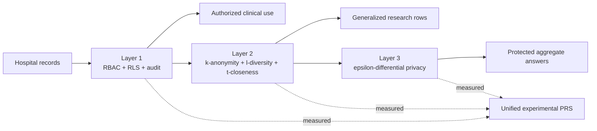
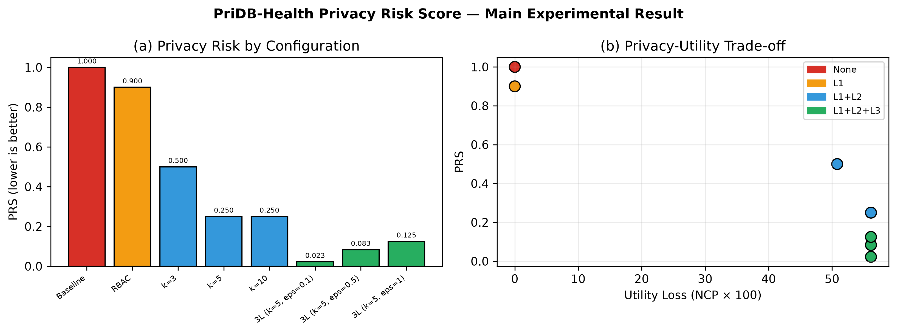

<div align="center">

# PriDB-Health

### A three-layer privacy-by-design research prototype for hospital databases

**Control who can see a record. Protect what leaves the database. Limit what aggregates can reveal.**

[](docs/RESEARCH_LIMITATIONS.md)
[](https://www.postgresql.org/)
[](https://www.python.org/)
[](tests/)
[](RESEARCH_EVIDENCE_STATUS.md)
[](LICENSE)

[**Explore the interactive research story →**](https://the-sudipta.github.io/pridb-health/) · [Reproduce the experiment](#reproduce-the-study) · [Read the method](docs/METHODOLOGY.md) · [Cite this work](CITATION.cff)

</div>

---

## The human problem

Imagine a hospital database as a busy building. Doctors, nurses, patients, researchers, and administrators all need different doors. A strong lock on the front door is essential—but it is not enough.

Once health data is copied for research, a person can sometimes be recognized from ordinary details such as age, gender, and ZIP code. Once statistics are published, repeated queries can leak information about small groups. Each privacy tool solves one part of this story, but hospitals need the parts to work together.

PriDB-Health asks one practical research question:

> **Can access control, anonymized research data, and differentially private statistics be designed and evaluated as one database-level privacy system?**

## What was missing

Previous privacy mechanisms are often designed or evaluated separately. That leaves four practical gaps.

<table width="100%">
  <thead>
    <tr>
      <th width="22%">Gap</th>
      <th width="39%">Why it matters</th>
      <th width="39%">PriDB-Health response</th>
    </tr>
  </thead>
  <tbody>
    <tr>
      <td><strong>Access is not release protection</strong></td>
      <td>RBAC controls who enters, but not whether exported research rows are re-identifiable.</td>
      <td>PostgreSQL RBAC/RLS is combined with a separate anonymization layer.</td>
    </tr>
    <tr>
      <td><strong>Anonymity is not query privacy</strong></td>
      <td>Generalized microdata does not automatically protect repeated aggregate queries.</td>
      <td>Calibrated Laplace noise protects count and bounded-average queries.</td>
    </tr>
    <tr>
      <td><strong>Results are hard to compare</strong></td>
      <td>Mechanisms report different metrics, making cross-layer comparisons difficult.</td>
      <td>A transparent experimental Privacy Risk Score (PRS) compares eight configurations.</td>
    </tr>
    <tr>
      <td><strong>Controls drift away from schemas</strong></td>
      <td>Security promises can exist only in application code or documentation.</td>
      <td>Roles, policies, views, constraints, and audit triggers live in PostgreSQL.</td>
    </tr>
  </tbody>
</table>

## The proposed contribution

PriDB-Health is a reproducible prototype that connects three privacy layers at the database boundary:



<table width="100%">
  <thead>
    <tr>
      <th width="18%">Layer</th>
      <th width="28%">Mechanisms</th>
      <th width="27%">Threat addressed</th>
      <th width="27%">Evidence produced</th>
    </tr>
  </thead>
  <tbody>
    <tr>
      <td><strong>1 · Govern</strong></td>
      <td>Five roles, column grants, row-level security, secured views, JSONB audit trail</td>
      <td>Unauthorized access and privilege overreach</td>
      <td>Expected-denial tests and live PostgreSQL verification</td>
    </tr>
    <tr>
      <td><strong>2 · De-identify</strong></td>
      <td>k-anonymity, distinct l-diversity, categorical t-closeness, suppression</td>
      <td>Linkage and attribute disclosure in research rows</td>
      <td>RRR, prosecutor risk, suppression, NCP, l/t satisfaction</td>
    </tr>
    <tr>
      <td><strong>3 · Bound inference</strong></td>
      <td>Laplace mechanism for counts and bounded averages</td>
      <td>Inference through released aggregate statistics</td>
      <td>100-trial error distributions at three privacy budgets</td>
    </tr>
  </tbody>
</table>

## Benchmark extension

The repository now includes a public real-data benchmark in addition to the synthetic schema-control experiment. The official UCI Heart Disease Cleveland file is preserved under [`dataset/`](dataset/), including its CC BY 4.0 provenance, DOI, SHA-256 checksum, and a documented 303-to-297 complete-case preprocessing rule. The UCI experiment assesses release and aggregate-query protection (Layers 2-3); it does not claim to measure a real access-control breach rate.

Run the end-to-end pipeline to generate UCI and cross-dataset figures in `outputs/uci_heart/` and `outputs/comparative/`. Read the [PRS derivation and validation](docs/PRS_DERIVATION_AND_VALIDATION.md) before interpreting its composite score.

## Main result

The deterministic experiment generates 1,000 synthetic patients and evaluates eight configurations. Under the explicitly defined PRS used by this repository, risk decreases strictly as layers are added:

<div align="center">

### `1.0000` → `0.9000` → `0.2500` → `0.0227`

**Baseline → RBAC/RLS → + anonymization → + differential privacy**

### 97.7% lower PRS than the unprotected baseline



</div>

<table width="100%">
  <thead>
    <tr>
      <th width="32%">Configuration</th>
      <th width="17%">PRS</th>
      <th width="17%">RRR</th>
      <th width="17%">l=2 / t=0.3</th>
      <th width="17%">Interpretation</th>
    </tr>
  </thead>
  <tbody>
    <tr><td>Baseline</td><td>1.0000</td><td>1.0000</td><td>Not applied</td><td>Highest measured risk</td></tr>
    <tr><td>RBAC + RLS</td><td>0.9000</td><td>0.6000</td><td>Not applied</td><td>Access risk reduced</td></tr>
    <tr><td>RBAC + k=5</td><td>0.2500</td><td>0.0000</td><td>100% / 100%</td><td>Microdata disclosure reduced</td></tr>
    <tr><td><strong>All layers, k=5, ε=0.1</strong></td><td><strong>0.0227</strong></td><td><strong>0.0000</strong></td><td><strong>100% / 100%</strong></td><td><strong>Lowest measured PRS</strong></td></tr>
  </tbody>
</table>

The k=5 release retained 981 records, suppressed 19 (1.9%), satisfied distinct l=2 and categorical t=0.3 for every retained equivalence class, and had NCP 0.5613. The strongest tested DP setting (ε=0.1) produced a mean absolute count error of 9.0 across 100 seeded trials.

> [!IMPORTANT]
> “97.7% lower” is an internal result under this repository's PRS definition, synthetic dataset, and tested parameters. It is strong evidence that the implemented layers contribute under the declared experiment; it is not by itself proof of worldwide priority, clinical safety, or legal compliance. See [Research limitations](docs/RESEARCH_LIMITATIONS.md).

## Why the result is interesting

The contribution is not that RBAC, k-anonymity, or differential privacy was invented here. The research contribution being evaluated is their **schema-level integration**, a **repeatable cross-layer experiment**, and an **explicit scalar comparison** that makes assumptions inspectable.

This turns a vague promise—“we use several privacy tools”—into something reviewers can run, challenge, extend, and compare.

## Try it yourself

The companion site includes two browser-only experiments:

1. **Build the privacy shield** — choose k and ε, then see the PRS and utility trade-off update immediately.
2. **Ask a private question** — enter a true count and generate fresh Laplace-noised answers to see why privacy and accuracy move in opposite directions.

No input leaves the browser and no health data is collected.

### [Launch the interactive PriDB-Health story →](https://the-sudipta.github.io/pridb-health/)

## Reproduce the study

### 1. Prepare Python

```powershell
git clone https://github.com/the-sudipta/pridb-health.git
cd pridb-health
python -m venv .venv
.\.venv\Scripts\python.exe -m pip install -r requirements.txt
```

### 2. Verify and run

```powershell
.\.venv\Scripts\python.exe -m pytest tests -v
.\.venv\Scripts\python.exe run_full_analysis.py
.\.venv\Scripts\python.exe verify_research_evidence.py
.\.venv\Scripts\python.exe novelty_verifier.py
.\.venv\Scripts\python.exe generate_paper_figures.py
```

### 3. Recreate PostgreSQL

PostgreSQL 15+ is required; the reference implementation was verified on PostgreSQL 18.

```powershell
$env:PGSUPER_PASSWORD = '<your-postgres-superuser-password>'
.\setup_postgres.ps1
Remove-Item Env:PGSUPER_PASSWORD
```

The script is idempotent: it creates the application database and role, applies all policies and views, reloads the synthetic data, and runs security assertions.

## Verified implementation

<table width="100%">
  <thead>
    <tr>
      <th width="34%">Verification</th>
      <th width="18%">Result</th>
      <th width="48%">What was checked</th>
    </tr>
  </thead>
  <tbody>
    <tr><td>Python unit tests</td><td>16/16 pass</td><td>PRS bounds, anonymization invariants, DP query behavior</td></tr>
    <tr><td>Internal stop conditions</td><td>12/12 pass</td><td>Outputs, layer ladder, k=5 l/t checks, DP noise ordering</td></tr>
    <tr><td>PostgreSQL security</td><td>Pass</td><td>Six tables, nine RLS policies, secured views, least-privilege grants</td></tr>
    <tr><td>Expected denials</td><td>5/5 pass</td><td>Doctor SSN, nurse/researcher base tables, portal SSN, audit deletion</td></tr>
    <tr><td>Audit behavior</td><td>Pass</td><td>A permitted doctor update appended exactly one audit event</td></tr>
    <tr><td>Paper artifacts</td><td>Complete</td><td>Seven result CSVs, five PNG/PDF figures, two visual tables</td></tr>
  </tbody>
</table>

## Repository map

```text
pridb-health/
├── index.html                  # Interactive research story
├── src/                        # Analysis and privacy modules
├── sql/                        # Schema, RBAC/RLS, views, audit, verification
├── tests/                      # Deterministic unit tests
├── assets/                     # Website figures and reproducibility data
├── docs/                       # Method, limitations, implementation guide
├── run_full_analysis.py        # End-to-end experiment
├── novelty_verifier.py         # Internal criteria verifier
├── generate_paper_figures.py   # Publication-format output generator
└── setup_postgres.ps1          # Idempotent PostgreSQL deployment
```

## Research integrity and scope

- The implementation includes synthetic records and the public, de-identified UCI Cleveland benchmark. It includes no contemporary or local patient data.
- The PRS formula, assumptions, citations, and sensitivity analysis are documented in [`docs/PRS_DERIVATION_AND_VALIDATION.md`](docs/PRS_DERIVATION_AND_VALIDATION.md).
- Randomness used for reported trials is seeded for reproducibility.
- Compliance mapping is a design aid, not legal advice or certification.
- Independent literature review, external datasets, sensitivity analysis, and peer review remain necessary before a worldwide novelty claim.

## Research directions

PriDB-Health is designed as a foundation for deeper doctoral-scale work: learned privacy-risk weights, formal composition accounting, privacy attacks as benchmarks, multi-hospital federated evaluation, rare-disease utility studies, longitudinal data, and prospective governance studies. See the [research roadmap](ROADMAP.md).

## Citation

If this prototype supports your work, use the metadata in [`CITATION.cff`](CITATION.cff). GitHub will also expose a **Cite this repository** button.

## Contributing

Research questions, replications, adversarial evaluations, and implementation improvements are welcome. Please read [CONTRIBUTING.md](CONTRIBUTING.md), [SECURITY.md](SECURITY.md), and the [Code of Conduct](CODE_OF_CONDUCT.md).

## License

Code is available under the [Apache License 2.0](LICENSE). Generated figures and written research materials remain subject to attribution; see [NOTICE](NOTICE).

---

<div align="center">

**Built to make health-data privacy measurable, inspectable, and easier to improve.**

[Interactive story](https://the-sudipta.github.io/pridb-health/) · [Methodology](docs/METHODOLOGY.md) · [Results](assets/data/04_prs_results.csv) · [Roadmap](ROADMAP.md)

</div>

